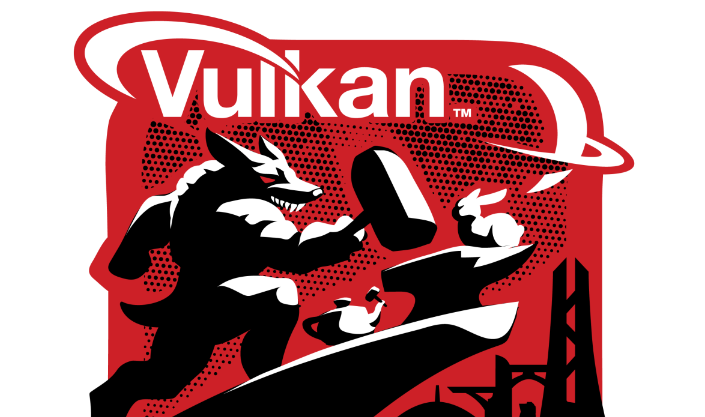

# Vulkan GameDev Linux Container



Ready-to-use Linux container for Vulkan C++ game development with vcpkg dependencies.

## Features

- Ubuntu 22.04 base
- Vulkan SDK and development tools
- vcpkg package manager pre-installed
- AppImage build support
- CMake and build tools
- GLFW and X11 libraries

## Usage

```bash
docker pull elipwns/vulkan-gamedev-containers
docker run -it --rm -v $(pwd):/workspace elipwns/vulkan-gamedev-containers
```

## Building

```bash
docker build -f docker/Dockerfile.linux -t vulkan-gamedev-containers .
```

## Environment Variables

- `VCPKG_ROOT=/vcpkg`
- `VULKAN_SDK=/usr`
- `CMAKE_TOOLCHAIN_FILE=/vcpkg/scripts/buildsystems/vcpkg.cmake`

## License

MIT